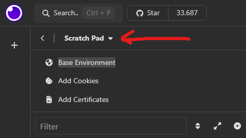

# Proyecto final para Codo a Codo 2024

### Clonar el repositorio

En la carpeta deseada ejecutar el comando

```bash
git clone https://github.com/alegaon/proyecto_final_G4.git
```

### Instalaciones desde Visual Studio Code

- Instalar librerias del proyecto

```bash
pip install -r requierements.txt
```

### Correr Backend

Desde la consola, dentro de la carpeta del backend, ejecutar el comando

```bash
python run.py
```

# Uso de Insomnia

### Importar archivo json

Para cargar los request de prueba, importar en Insomnia el archivo

```bash
Insomnia_2024-07-12.json
```



Seleccionar la opcion Importar
