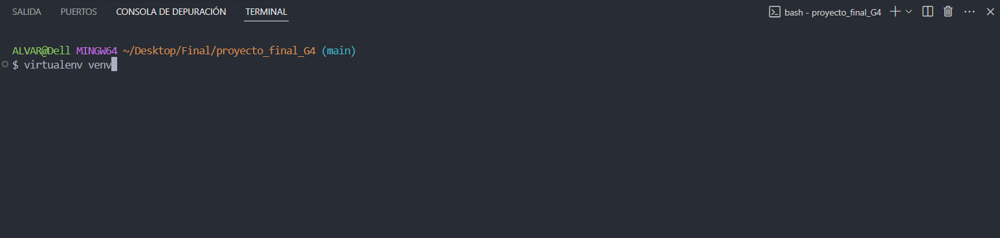
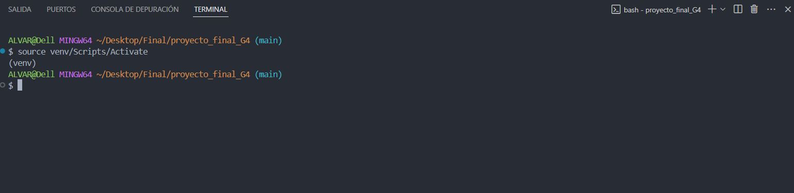

# Proyecto final para Codo a Codo 2024

## Repositorio virtual


##### Crear repositorio
* Desde la terminal del VSCode, ejecutar el comando en la terminal bash.

    ```bash
    virtualenv venv
    ```



##### Activar el repositorio
* Para activar el repositorio y postetiormente instalar las librerias necesarias, ejecutar el siguiente comando en la terminal bash.

    ```bash
    source venv/Scripts/Activate
    ```



Una vez finalizado la creacion del entorno de trabajo y que este activado, continuamos con el repositorio.

### Clonar el repositorio

En la carpeta deseada ejecutar el comando
****
```bash
git clone https://github.com/alegaon/proyecto_final_G4.git
```

### Instalaciones desde Visual Studio Code

- Instalar librerias del proyecto

```bash
pip install -r requirements.txt
```

### Correr Backend

Desde la consola, dentro de la carpeta del backend, ejecutar el comando

```bash
python run.py
```

# Uso de Insomnia

### Importar archivo json

Para cargar los request de prueba, importar en Insomnia el archivo

```bash
Insomnia_2024-07-12.json
```


Seleccionar la opcion Importar. Y cargar el archivo JSON. Luego correr las request POST para cargar al menos 4 datos en la base y poder ejecutar algunos GET, PUT y DELETE.
